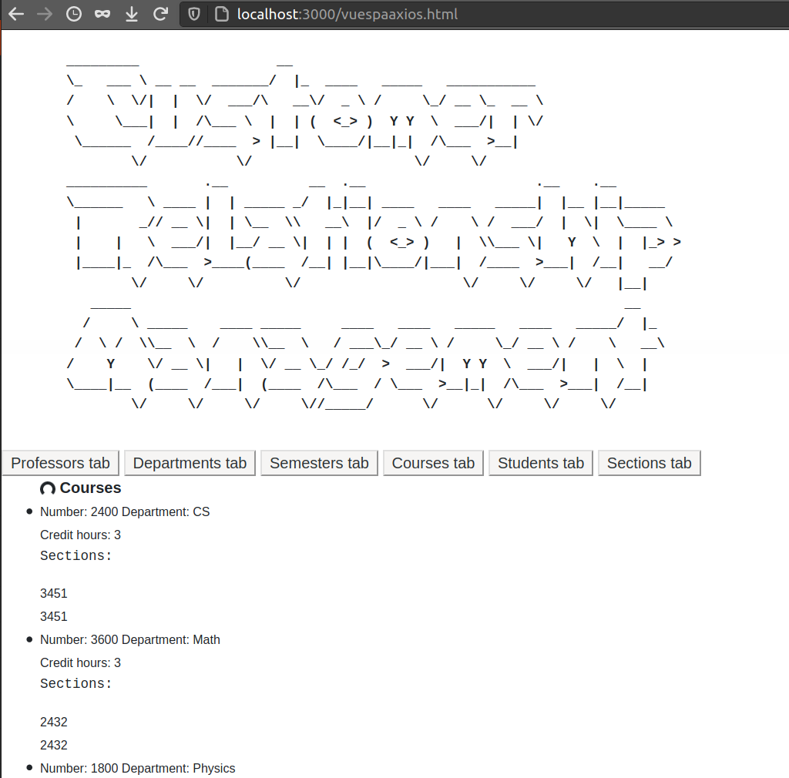

# Larsen Close

   >lclose@msudenver.edu

## Web Application Development

### Dual API CRM utilizing .html and .json

> Completed

- [x] Integrate all element gets into single page application with javascript

> Todo's

- [ ] CRUD finish out other functionality

1. Public html file is [vuespaaxios.html](./CRM/public/vuespaaxios.html), served at: [http://localhost:3000/vuespaaxios.html](http://localhost:3000/vuespaaxios.html)
   - based partially from: [https://github.com/drsjb80/SPAs/blob/master/vueaxiosspa1toM.html](https://github.com/drsjb80/SPAs/blob/master/vueaxiosspa1toM.html)
2. .choices #4 `rails db:drop; rails db:migrate; rails db:seed; rails server`
3. db:seed should be good but there is also a backup `/seedsDir/seeds.rb`

- Rails 6.0.3.3
- Ruby version 2.7.1
- Yarn v1.22.5
- package.json and Gemfile + Gemlock have the rest

#### To access the SPA first create a user and login at: [http://localhost:3000/](`http://localhost:3000/)

> Then access the single page application at [http://localhost:3000/vuespaaxios.html](http://localhost:3000/vuespaaxios.html)




> Current ERD with addition of the user Auth

> Abbreviated seeds.rb

```rails


Professor.create!([
  {name: "Dr. Keaten", office: "419"},
   ...
  {name: "Roger Penrose", office: "213"}
])
Department.create!([
  {name: "CS"},
   ...
  {name: "Biology"}
])

Course.create!([
  {department_id: 1, number: 2400, hours: 3},
   ...
  {department_id: 6, number: 4500, hours: 4}
])

Student.create!([
  {name: "Robin Hood", number: 956809},
   ...
  {name: "Summer Alexan", number: 900348}
])
Semester.create!([
  {semester: "Spring"},
   ...
  {semester: "Winter"}
])
Section.create!([
  {course_id: 1, professor_id: 2, year: 2019, semester_id: 3, section_number: 3451},
   ...
  {course_id: 3, professor_id: 4, year: 2020, semester_id: 2, section_number: 2232}
])

SectionsStudents.create!([
  {section_id: 6, student_id: 7},
  ...
  {section_id: 9, student_id: 1}
])
```

The commands generating my active migration:

```bash
rails generate scaffold Department name:string;
rails generate scaffold Professor name:string office:string;
rails generate scaffold Course number:integer hours:integer;
rails generate scaffold Student name:string number:integer;
rails generate scaffold Section year:integer;
rails generate scaffold Semester semester:string;
rails generate scaffold SectionsStudents section:references student:references --force-plural --force
rails db:migrate
```

> oh also I added an extra column to sections to indicate which section number of a class

To generate the erd:

1. installed graphviz
2. installed graphviz-rubymine
3. Added `gem 'rails-erd'` to :development in the gemfile
4. Reran `bundle install`
5. Created and customized a configuration file `.erdconfig`
6. Ran `bundle exec erd`

#### TODO's archive and backlog

1. Currently the multipage web app seems to be functioning well. Login at the index page (127.0.0.1:3000 on development server)
2. The js app in progress but can be accessed at 127.0.0.1:3000/vuespa.html
3. If weird things happen with the data base `rails db:drop; rails db:migrate; rails db:seed; rails server`
4. Gem seed_dump did work for me on rails 6 with a few changes to the object before being able to reload it

- [x] Complete validations
- [x] Bug in gui creation of a course, not recognizing existing state of department
- [ ] Autocomplete functionality
- [x] Add to seeds verbosity for trying search cases

- [x] added validations to every model. Basic rules thus far, fields which can be are limited to number_field and collection_select

> Add a search for each index page.

- [x] added a seach to each model which will search through all of the models relations which must be given at creation, either through declaration or relationship type. To be explicit the search function is added to each **Model** and is defined within the model Class for each.
