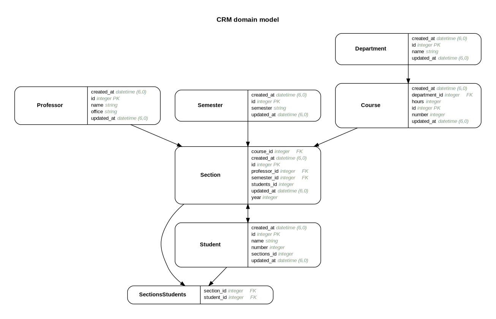

# Web Application Development

## Larsen Close

### Assignment 05

> Requirements

- [ ] Integrate all elements into single page application with javascript

- [ ] CRUD secondary priority




Used Migrations to fix the issue with redudndant ID's for sections and students. Also made simple non-rails celebration landing page. 


Current seed:db to test and explore search functionality:

``` rails

Semester.create(semester: 'Spring')
Semester.create(semester: 'Summer')
Semester.create(semester: 'Fall')

Department.create(name: 'CS')
Department.create(name: 'Math')
Department.create(name: 'Physics')
Department.create(name: 'Philosophy')
Department.create(name: 'Astronomy')

Professor.create(name: 'Dr. Keaten', office:'419')
Professor.create(name: 'Dr. Powell', office:'486')
Professor.create(name: 'Elizabeth Aster', office:'439')
Professor.create(name: 'Fredrick Douglass', office:'318')
Professor.create(name: 'Dr. Eliasa', office:'364')


Course.create(department_id: 1, number: 3710, hours: 4)
Course.create(department_id: 3, number: 2400, hours: 3)
Course.create(department_id: 2, number: 4500, hours: 4)

Course.create(department_id: 1, number: 3710, hours: 4)
Course.create(department_id: 3, number: 2400, hours: 3)
Course.create(department_id: 2, number: 4500, hours: 4)


Section.create(course_id: 1, section_number: 02, professor_id: 1, year: 2019, semester_id: 1)
Section.create(course_id: 1, section_number: 01, professor_id: 3, year: 2019, semester_id: 1)

Section.create(course_id: 2, section_number: 01, professor_id: 2, year: 2019, semester_id: 1)
Section.create(course_id: 2, section_number: 02, professor_id: 4, year: 2019, semester_id: 1)

Section.create(course_id: 3, section_number: 01, professor_id: 2, year: 2019, semester_id: 1)
Section.create(course_id: 3, section_number: 02, professor_id: 4, year: 2019, semester_id: 1)


Student.create(name: 'Robin Hood', number: 956809)
Student.create(name: 'Erik Eaten', number: 956223)
Student.create(name: 'Sarah Goodwill', number: 908416)
Student.create(name: 'Jennifer Maxwell', number: 903265)
Student.create(name: 'Roger Smith', number: 923658)
Student.create(name: 'Erica Klien', number: 93658)
```

Build wise I used:

``` bash
rails generate scaffold Department name:string;
rails generate scaffold Professor name:string office:string;
rails generate scaffold Course number:integer hours:integer;
rails generate scaffold Student name:string number:integer;
rails generate scaffold Section year:integer;
rails generate model SectionsStudents section:references student:references --force-plural;
rails generate scaffold Semester semester:string;
rails generate migration CreateJoinTableSectionStudent section student
```

> added an extra column to sections to indicate which section number of a class

Not using rubymine so I:

1. installed graphviz
2. installed graphviz-rubymine
3. Added ```gem 'rails-erd'``` to :development in the gemfile
4. Reran ```bundle install```
5. Created and customized a configuration file ```.erdconfig```
6. Ran ```bundle exec erd```

#### TODO's archive

- [x] Complete validations
- [X] Bug in gui creation of a course, not recognizing existing state of department
- [ ] Autocomplete functionality
- [x] Add to seeds verbosity for trying search cases

- [x] added validations to every model. Basic rules thus far, fields which can be are limited to number_field and collection_select

> Add a search for each index page.

- [x] added a seach to each model which will search through all of the models relations which must be given at creation, either through declaration or relationship type. To be explicit the search function is added to each **Model** and is defined within the model Class for each.
